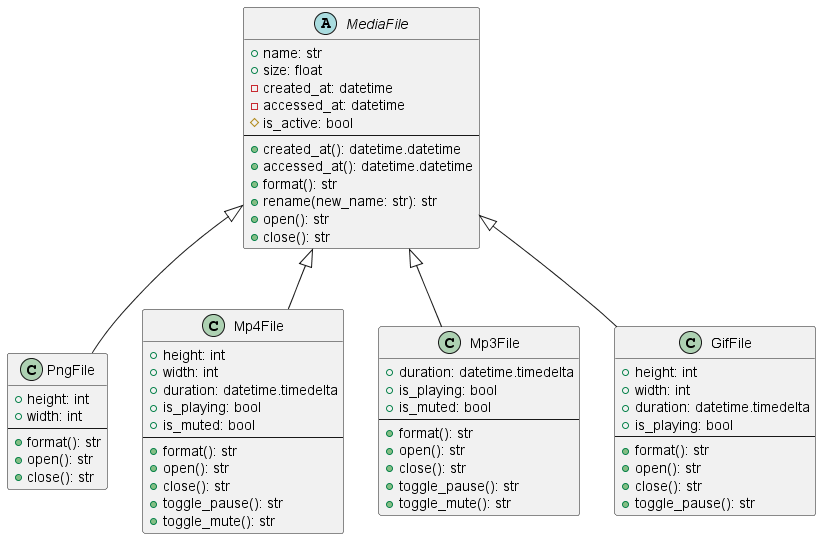

# Media File Management

## Team Members

-   CUSI, TYRONNE JOSHUA
-   DAPOC, ROMELIE JOY
-   RAMOS, SHIN-MIE
-   PLAZA, GEEVOI

## Project Description

This **Media File Management** is a Python-based simulation that models various types of media files using object-oriented programming principles. The system features an abstract base class `MediaFile`, which defines the core properties and behaviors shared across all media types. Derived classes include:

-   `PngFile` – A static image file with defined height and width.
-   `Mp4File` – A video file with play/pause and mute/unmute capabilities.
-   `Mp3File` – An audio file with play/pause and mute/unmute functionalities.
-   `GifFile` – An animated image file that supports pause and resume features.

All file types include metadata tracking (creation time, last access time), renaming, and open/close state management.

## Project Diagram



## How to Run the Program

### 1. Install Python

Ensure you have Python 3.6 or higher installed.  
Download it from: [https://www.python.org/downloads/](https://www.python.org/downloads/)

### 2. Save the Code

Copy the class definitions into a Python file named `media_files.py`.

### 3. Create a Driver Script

Create a new Python file (e.g., `test_media.py`) and include the following code to test:

```python
from media_files import PngFile, Mp4File, Mp3File, GifFile
from datetime import timedelta

video = Mp4File("sample_video", 1500, 1080, 1920, timedelta(seconds=42, minutes=10))
print(video.open())
print(video.toggle_pause())
print(video.toggle_mute())
print(video.close())

audio = Mp3File("music_track", 700, timedelta(seconds=30, minutes=3))
print(audio.open())
print(audio.toggle_pause())
print(audio.toggle_mute())
print(audio.close())
```

## Acknowledgement

We would like to express our deepest gratitude to our esteemed instructor, Ms. Fatima Marie Agdon, for her unwavering guidance, patience, and dedication throughout the course of CS 121. Her passion for teaching and commitment to our learning journey have greatly contributed to our academic and personal growth.

Her support has been instrumental in helping us understand complex concepts and apply them effectively. We are truly thankful for the opportunity to learn under her instruction.

As a light-hearted note of appreciation, just as Nayeon of TWICE brings energy and brightness to every stage she graces, Ms. Agdon brings the same enthusiasm and inspiration into every class. For that, we are truly fortunate.

Once again, thank you, Ms. Agdon, for your invaluable support and mentorship.
